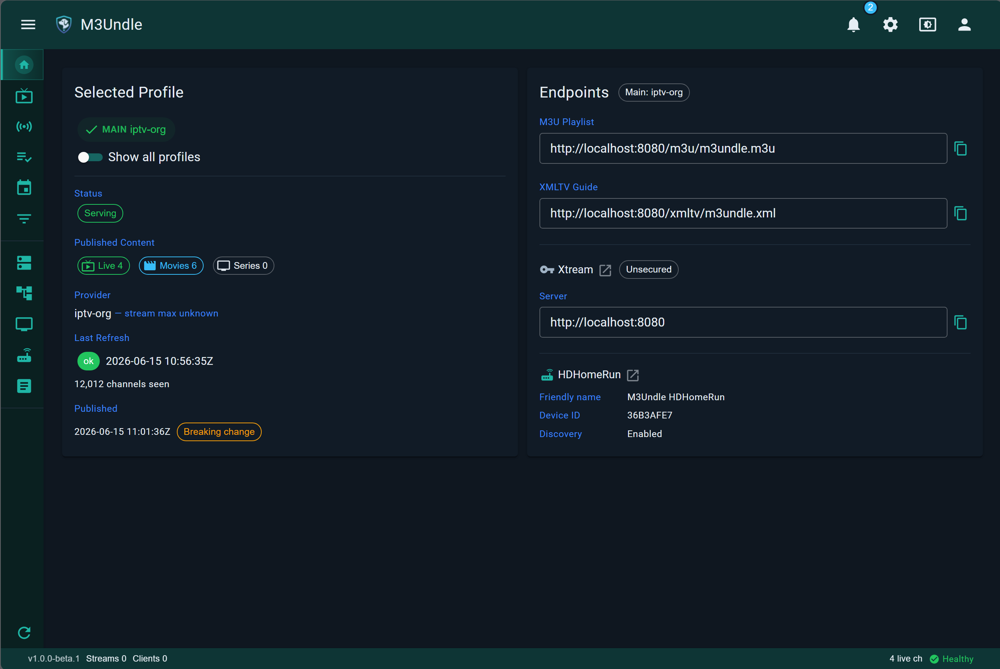

<div align="center">

# M3Undle

**Turn oversized IPTV provider lists into lineups your apps can actually use.**

[](https://github.com/Sydney-Elvis/M3Undle/actions/workflows/dotnet.yml)
[](https://github.com/Sydney-Elvis/M3Undle/releases/latest)
[](LICENSE)

[**Documentation**](https://sydney-elvis.github.io/M3Undle/) | [**Sponsor**](https://github.com/sponsors/Sydney-Elvis) | [**Buy Me a Coffee**](https://buymeacoffee.com/jake1164s) | [**Changelog**](CHANGELOG.md) | [**Docker**](https://github.com/Sydney-Elvis/M3Undle/pkgs/container/m3undle)

</div>

---

M3Undle is a self-hosted IPTV lineup manager and proxy for large M3U, XMLTV, Xtream, and HDHomeRun-style provider catalogs. It filters oversized provider lists down to the channels you actually want, assigns stable channel numbers, and publishes the result to DVRs, media servers, and IPTV apps — NextPVR, Jellyfin, IPTVnator, IPTV Smarters, and anything else that consumes M3U, XMLTV, Xtream, or HDHomeRun-compatible endpoints.

> [!NOTE]
> **Emby** and **Plex** support Live TV and DVR only with a paid subscription (Emby Premiere and Plex Pass respectively). Full compatibility with M3Undle has not been validated without those subscriptions.



> [!IMPORTANT]
> **Beta Status**
>
> M3Undle has completed all alpha milestones and is now in beta. The core workflow is fully implemented: streaming is hardened with shared-stream support, adaptive stream health tracking, and relay policy for unstable providers. Observability, Xtream detection, HDHomeRun integration, and interface polish are all in place.
>
> Beta focuses on broader DVR client validation, documentation, and final hardening before a stable release. It is suitable for real LAN use, but expect provider- and client-specific edge cases to surface during testing.

## Quick start

```bash
mkdir m3undle && cd m3undle && mkdir config
```

Create `compose.yaml`:

```yaml
services:
  m3undle:
    image: ghcr.io/sydney-elvis/m3undle:beta
    container_name: m3undle
    ports:
      - "5004:5004"
      - "8080:8080"
    environment:
      TZ: America/New_York
      M3UNDLE_ENCRYPTION_KEY: "replace-with-a-base64-32-byte-key"  # openssl rand -base64 32
    volumes:
      - ./config:/config
      - m3undle_data:/data
    restart: unless-stopped

volumes:
  m3undle_data:
```

```bash
docker compose up -d
```

Open `http://<host>:8080`, add a provider, and build your first lineup — see **[Install with Docker](https://sydney-elvis.github.io/M3Undle/getting-started/install-with-docker/)** and **[What M3Undle Does](https://sydney-elvis.github.io/M3Undle/getting-started/what-it-does/)** for the full walkthrough.

## What it does

- **Catalog cleanup** — exclude provider groups you don't want, filter channels by keyword/glob/regex
- **Custom lineups** — build your own output groups from any provider's channels, control numbering and order
- **Guide (EPG) mapping** — merge multiple XMLTV sources, set priority, override `tvg-id` per channel
- **Client outputs** — M3U, XMLTV, HDHomeRun-compatible, and Xtream-compatible endpoints from one managed lineup
- **Stream proxying** — provider credentials never reach clients; live streams are shared across viewers, not duplicated per connection
- **Stream health tracking** — per-channel Stable/Cautious/Unstable classification with configurable relay policy for noisy providers
- **Observability** — Prometheus-compatible metrics, health probes, and authenticated diagnostics APIs
- **Profiles** — named lineups with published history and automatic fallback to last-known-good output

See **[Core Concepts](https://sydney-elvis.github.io/M3Undle/concepts/providers/)** for how these fit together, or **[Guides](https://sydney-elvis.github.io/M3Undle/guides/build-a-lineup/)** for step-by-step workflows.

## Documentation

Full documentation — installation, concepts, guides, client setup, troubleshooting, and reference — is published at **[sydney-elvis.github.io/M3Undle](https://sydney-elvis.github.io/M3Undle/)**. Source lives under [`docs/user/`](docs/user/index.md) in this repo if you'd rather browse or edit it directly.

Start here:

- [What M3Undle Does](https://sydney-elvis.github.io/M3Undle/getting-started/what-it-does/)
- [Install with Docker](https://sydney-elvis.github.io/M3Undle/getting-started/install-with-docker/)
- [Connect a Client](https://sydney-elvis.github.io/M3Undle/getting-started/connect-first-client/)
- [Troubleshooting](https://sydney-elvis.github.io/M3Undle/troubleshooting/client-cannot-connect/)

## Security notes

M3Undle is designed for self-hosted use on a trusted network. For first-run testing, the web UI can run without authentication — before exposing it outside your LAN, enable UI authentication and endpoint security, and put it behind a reverse proxy or firewall rules you trust. See [Security](https://sydney-elvis.github.io/M3Undle/concepts/security/).

You are responsible for the sources you configure and for following the terms that apply to them.

## Roadmap

All alpha milestones are complete; M3Undle is in beta, focused on DVR client validation, documentation, and hardening ahead of a release candidate and v1.0.0. See [CHANGELOG.md](CHANGELOG.md) for release history.

## Support

If you find M3Undle useful and want to support the work:

<a href="https://buymeacoffee.com/jake1164s"></a>

You can also [sponsor M3Undle on GitHub](https://github.com/sponsors/Sydney-Elvis).

## Contributing

M3Undle is built with .NET and a server-side Blazor web UI. AI-assisted tools are used for implementation, testing, and documentation, but every change is human-reviewed and must build cleanly and pass the full automated test suite with zero warnings before it merges.

Contribution work is currently issue-driven — start with an open issue or file one describing the problem before opening a larger pull request. See **[CONTRIBUTING.md](CONTRIBUTING.md)** for the development setup, coding guidelines, and testing expectations.

## Disclaimer

> [!IMPORTANT]
> M3Undle does not provide playlists, streams, channels, guide data, subscriptions, or other media content.
>
> M3Undle is a self-hosted management and proxy tool. It only works with sources that you configure, such as provider URLs, local playlist files, XMLTV guide sources, and client credentials.
>
> You are responsible for the legality, licensing, and terms of use for any source you add to M3Undle. Do not use M3Undle to access, distribute, or restream content you are not authorized to use.

## License

M3Undle is licensed under the Apache License 2.0. See [LICENSE](LICENSE).
