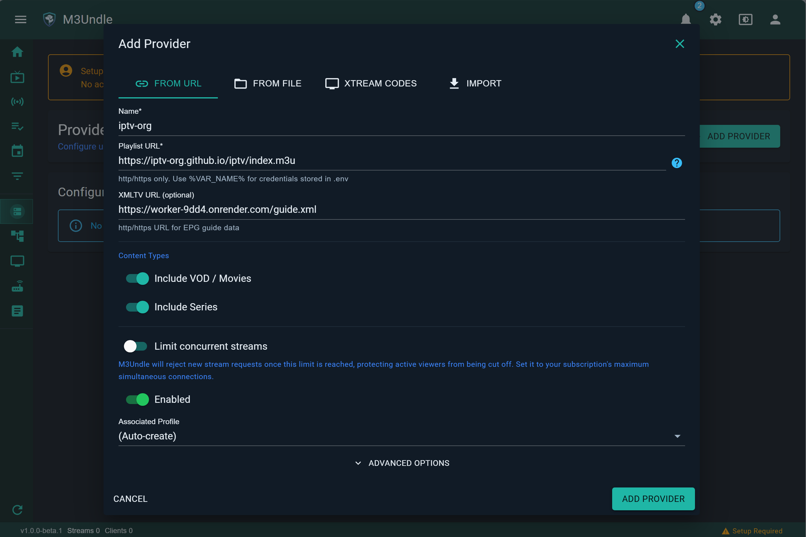
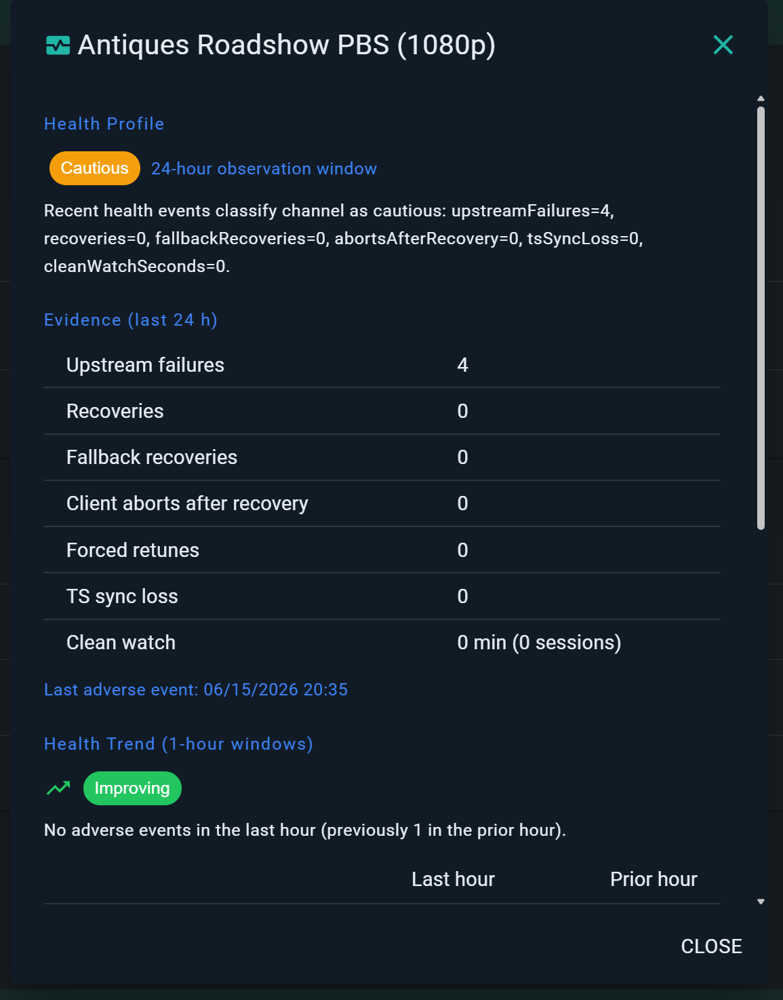
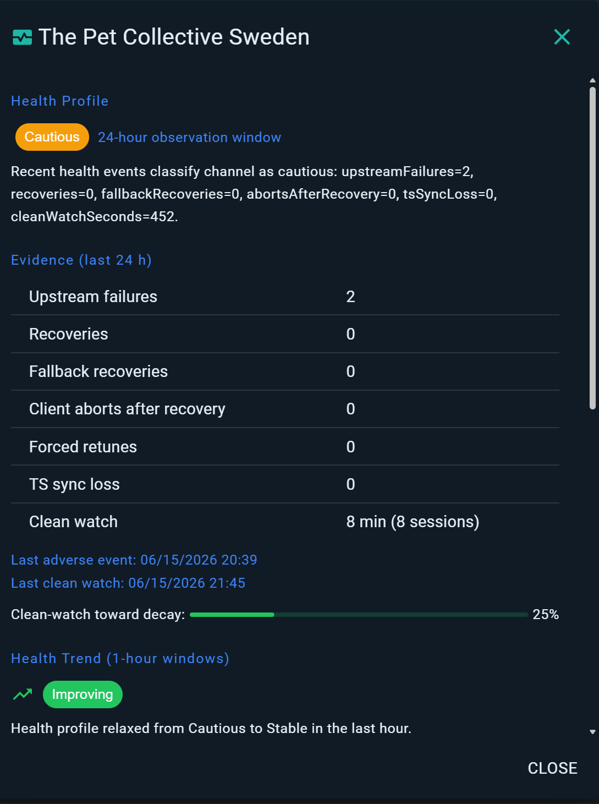
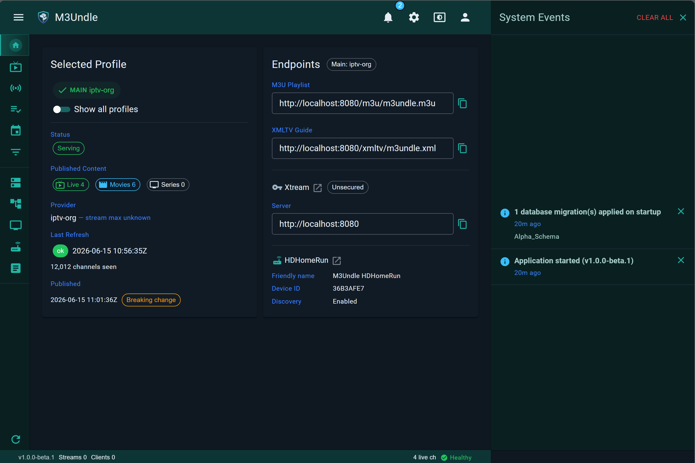

# M3Undle

**Turn oversized IPTV provider lists into lineups your apps can actually use.**

[**Sponsor**](https://github.com/sponsors/Sydney-Elvis) | [**Buy Me a Coffee**](https://buymeacoffee.com/jake1164s) | [**Changelog**](CHANGELOG.md) | [**Docker**](https://github.com/Sydney-Elvis/M3Undle/pkgs/container/m3undle)

---

M3Undle is a self-hosted IPTV lineup manager and proxy for large M3U, XMLTV, Xtream, and HDHomeRun-style provider catalogs.

It helps you filter out provider groups you do not care about, collect the channels you do want into your own groups, assign stable channel numbers, and publish a smaller lineup to DVRs, media servers, browser-based players, and IPTV apps.

Works with clients such as NextPVR, Jellyfin, IPTVnator, IPTV Smarters, and other apps that consume M3U, XMLTV, Xtream, or HDHomeRun-compatible endpoints.

> [!NOTE]
> **Emby** and **Plex** support Live TV and DVR only with a paid subscription (Emby Premiere and Plex Pass respectively). Full compatibility with M3Undle has not been validated without those subscriptions.

> [!IMPORTANT]
> **Beta Status**
>
> M3Undle has completed all alpha milestones and is now in beta. The core workflow is fully implemented: streaming is hardened with shared-stream support, adaptive stream health tracking, and relay policy for unstable providers. Observability, Xtream detection, HDHomeRun integration, and interface polish are all in place.
>
> Beta focuses on broader DVR client validation, documentation, and final hardening before a stable release. It is suitable for real LAN use, but expect provider- and client-specific edge cases to surface during testing.

## Run it

M3Undle is published to GitHub Container Registry.

Pull the current beta image:

    docker pull ghcr.io/sydney-elvis/m3undle:beta

Create a working directory:

    mkdir m3undle
    cd m3undle
    mkdir config

Create `compose.yaml`:

    services:
      m3undle:
        image: ghcr.io/sydney-elvis/m3undle:beta
        container_name: m3undle
        ports:
          - "5004:5004"
          - "8080:8080"
        environment:
          TZ: America/New_York
          M3UNDLE_ENCRYPTION_KEY: "replace-with-a-base64-32-byte-key"
        volumes:
          - ./config:/config
          - m3undle_data:/data
        restart: unless-stopped

    volumes:
      m3undle_data:

Generate an encryption key:

    openssl rand -base64 32

Paste the generated value into `M3UNDLE_ENCRYPTION_KEY`, then start M3Undle:

    docker compose up -d

Open the web UI:

    http://<host>:8080

Port `8080` serves the web UI, M3U, XMLTV, Xtream, and general compatibility endpoints. Port `5004` serves HDHomeRun-compatible tuning.

The `config` folder is bind-mounted so configuration files stay easy to inspect and back up. Runtime state, logs, snapshots, and browser playback working files use the Docker-managed `m3undle_data` volume.

Use `beta` for the latest beta build. Specific release tags are listed on the [M3Undle container registry page](https://github.com/Sydney-Elvis/M3Undle/pkgs/container/m3undle).

`latest` is not used during alpha or beta. It will be introduced no earlier than the release candidate track.

For full Docker options, including local M3U file mounts, authentication, HDHomeRun discovery, and advanced networking, see [docs/DOCKER.md](docs/DOCKER.md).

## First workflow

Start by reducing the provider catalog to something your clients should actually see.

1. Add a provider.
2. Exclude provider groups you do not want, such as international packages, duplicate regions, or categories you never watch.
3. Create your own output group, such as `Locals`.
4. Add selected channels from one or more provider groups into that output group.
5. Number and order those channels the way you want them to appear.
6. Publish the lineup.
7. Point NextPVR, Jellyfin, IPTVnator, IPTV Smarters, or another client at the published output.

Instead of making every client parse the full provider list, M3Undle publishes only the lineup you built.

The provider dialog supports URL playlists, local files, Xtream Codes, imported configuration, optional XMLTV guide URLs, content-type toggles, provider stream limits, and profile association.

## What it does

### Catalog cleanup

M3Undle lets you exclude provider groups you do not want, browse what remains, and filter channels by keyword, glob, or regex.

### Custom lineups

Create your own output groups, add selected channels from provider groups, rename groups for the published output, and control channel numbering, pinning, and order.

### Guide and mapping

Manage EPG sources, merge XMLTV data, set guide priority, override `tvg-id` values, and review new channels before they appear in the published lineup.

### Client outputs

Publish the same managed lineup through M3U, XMLTV, HDHomeRun-compatible, and Xtream-compatible endpoints.

### Streaming

Proxy live streams through M3Undle, hide provider credentials from clients, share live streams across multiple downstream clients, and monitor active stream sessions. M3Undle tracks per-channel stream health (Stable, Cautious, Unstable) and uses configurable relay policy to handle noisy provider channels without disrupting connected clients.

The stream health panel highlights unstable channels over a 24-hour observation window. A channel can remain cautious when recent upstream failures have not yet been offset by recoveries, and it can relax back toward stable once clean watch time accumulates.

### Observability

Expose Prometheus-compatible metrics, liveness/readiness probes, and authenticated diagnostics APIs for monitoring provider refreshes, streams, lineup publishing, EPG status, and HDHomeRun activity.

The dashboard surfaces copy-ready client endpoints, current published state, and system events such as startup and migration activity without requiring log access for routine checks.

### Profiles and publishing

Use named profiles, switch the active published profile, keep published history, and fall back to last-known-good output when needed.

### Administration

Configure global refresh defaults, per-profile and per-provider refresh schedules, endpoint security, optional UI authentication, downstream notifications, provider stream limits, and service behavior from the web UI or Docker configuration.

## Client endpoints

After publishing a lineup, point your clients at M3Undle instead of the raw provider URL.

| Client type | URL |
|---|---|
| M3U playlist | `http://<host>:8080/m3u/m3undle.m3u` |
| XMLTV guide | `http://<host>:8080/xmltv/m3undle.xml` |
| HDHomeRun-style tuner | `http://<host>:5004` |
| Xtream-style API | `http://<host>:8080` |
| Prometheus metrics | `http://<host>:8080/metrics` |
| Health probes | `http://<host>:8080/livez`, `http://<host>:8080/readyz` |

For HDHomeRun-style clients, manual tuner setup is usually the most reliable option. Use `http://<host>:5004`.

For Xtream-style clients, add M3Undle as the server URL and use the endpoint credentials configured in M3Undle.

The metrics endpoint defaults to local-only access. For metrics modes, tokens, health probes, diagnostics APIs, and Prometheus examples, see [docs/OBSERVABILITY.md](docs/OBSERVABILITY.md).

## Minimal configuration

Most settings can be changed later from the web UI. For a first run, only a few Docker settings matter.

| Setting | Required | Default | Purpose |
|---|---:|---|---|
| `TZ` | No | Host/default timezone | Sets timestamps for logs and scheduled refresh behavior. |
| `M3UNDLE_ENCRYPTION_KEY` | Required for Xtream providers | None | Encrypts stored Xtream provider passwords. Keep this value backed up. Rotatable via `M3UNDLE_ENCRYPTION_KEYS` — see [docs/DOCKER.md](docs/DOCKER.md#rotating-the-encryption-key). |
| `/config` | Yes | None | Human-readable configuration files and optional provider credential placeholders. |
| `/data` | Yes | None | Database, snapshots, logs, runtime state, and temporary browser playback files. |
| `5004` | Recommended | `5004` | HDHomeRun-compatible tuning endpoint. |
| `8080` | Yes | `8080` | Web UI and general client endpoints. |

The README example bind-mounts `./config` so it is easy to inspect and back up. Runtime data uses a Docker-managed volume.

UI authentication and endpoint security are configured separately. The UI can be protected with environment variables, while client-facing endpoint credentials are managed inside M3Undle.

See [docs/DOCKER.md](docs/DOCKER.md) for advanced Docker options.

## Security and usage notes

M3Undle is designed for self-hosted use on a trusted network.

For first-run testing, the web UI can run without authentication. Before exposing it outside your LAN, enable UI authentication, configure endpoint security, and put it behind a reverse proxy or firewall rules you trust.

Client-facing endpoints are separate from the web UI. Use endpoint credentials for M3U, XMLTV, stream, HDHomeRun, and Xtream access when clients need to connect from outside a trusted network.

Provider credentials should stay in M3Undle. Published stream URLs are proxied so clients do not need direct provider URLs.

Respect your provider stream limits. M3Undle can help share live streams and apply configured limits, but it cannot make an upstream provider allow more connections than your account supports.

You are responsible for the sources you configure and for following the terms that apply to those sources.

## Troubleshooting

Start with the container logs:

    docker logs m3undle --tail 200

Check that the web UI is reachable:

    curl -I http://<host>:8080

Check that the M3U endpoint is reachable:

    curl -I http://<host>:8080/m3u/m3undle.m3u

Check that the XMLTV endpoint is reachable:

    curl -I http://<host>:8080/xmltv/m3undle.xml

Check the HDHomeRun discovery endpoint:

    curl http://<host>:5004/discover.json

Check service health:

    curl -i http://<host>:8080/livez
    curl -i http://<host>:8080/readyz

Common first checks:

| Problem | Check |
|---|---|
| Web UI does not load | Confirm the container is running and port `8080` is mapped. |
| No channels appear in a client | Publish a lineup first, then check the M3U endpoint directly. |
| XMLTV guide is missing | Confirm an EPG source is configured and the guide has been published. |
| HDHomeRun client cannot find M3Undle | Add the tuner manually with `http://<host>:5004`. Auto-discovery depends on Docker networking and multicast. |
| Xtream provider fails to save | Confirm `M3UNDLE_ENCRYPTION_KEY` (or `M3UNDLE_ENCRYPTION_KEYS`) is set and has not changed since the provider was added. If it changed, check `GET /api/v1/encryption/status` and see the rotation guide in [docs/DOCKER.md](docs/DOCKER.md#rotating-the-encryption-key). |
| Browser playback fails | Check stream status in the web UI and confirm the `/data` volume is writable. |
| Streams stop or fail to start | Check provider limits, active stream sessions, and container logs. |
| Monitoring scrape fails | Check the metrics access mode in Settings and see [docs/OBSERVABILITY.md](docs/OBSERVABILITY.md). |

When reporting an issue, include the M3Undle version tag, Docker compose file with secrets removed, client name, endpoint type, and relevant logs.

## Roadmap

All alpha milestones are complete. M3Undle is now in beta.

Release path:

1. Alpha 6 — released.
2. Alpha 7 — released. Adaptive stream recovery, relay policy, stream health tracking, interface polish, and HDHomeRun improvements.
3. **Beta — current.** No new features beyond gaps identified during testing. Focus is on broader DVR client validation, documentation, and final hardening.
4. Release candidate — final validation and packaging.
5. v1.0.0 — stable release.

After v1.0.0, planned work moves toward more advanced provider handling:

- multiple sources per profile
- fallback sources
- per-provider VPN

## Support

M3Undle is built as an open-source project and is currently focused on getting through beta, release candidate validation, and v1.0.0.

If you find it useful and want to support the work:

You can also [sponsor M3Undle on GitHub](https://github.com/sponsors/Sydney-Elvis).

## Development and contributing

M3Undle is built with .NET and the web UI is server-side Blazor. AI-assisted tools are used for implementation, testing, and documentation, but every change is still human-reviewed and has to build cleanly and pass the full automated test suite with zero warnings before it merges.

In addition to the public automated test suite, changes affecting streaming, provider compatibility, or failure recovery are exercised against a private simulator-backed lab — simulated upstream providers and concurrent clients used to validate reconnects, stalls, shared-stream behavior, and HLS delivery under conditions that are hard to reproduce with unit tests alone. This lab isn't public, so its results aren't part of the CI badge above.

For now, contribution work is expected to be issue-driven. If you want to help, start with an open issue or file a new one describing the problem before opening a larger pull request.

Basic local workflow:

    git clone https://github.com/Sydney-Elvis/M3Undle.git
    cd M3Undle
    dotnet restore
    dotnet build
    dotnet test

Before submitting a pull request:

- keep changes focused
- include tests when practical
- avoid mixing formatting-only changes with functional changes
- describe the client, provider type, and endpoint path involved if the change affects playback or compatibility

More detailed contributor docs will be added during beta.

## Disclaimer

> [!IMPORTANT]
> M3Undle does not provide playlists, streams, channels, guide data, subscriptions, or other media content.
>
> M3Undle is a self-hosted management and proxy tool. It only works with sources that you configure, such as provider URLs, local playlist files, XMLTV guide sources, and client credentials.
>
> You are responsible for the legality, licensing, and terms of use for any source you add to M3Undle. Do not use M3Undle to access, distribute, or restream content you are not authorized to use.

## License

M3Undle is licensed under the Apache License 2.0. See [LICENSE](LICENSE).

