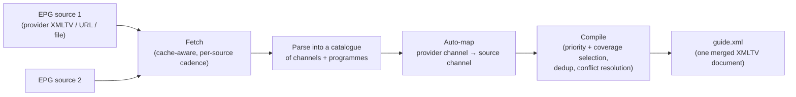

# EPG Pipeline

[EPG](../concepts/epg.md) explains how to configure sources and mappings. This page explains what actually happens between "fetch a guide file" and "programme data lines up with the right channel in your client" — three separate stages that run every refresh cycle: fetch, map, compile.

## Fetch: cache-aware, per-source

Every enabled EPG source for a provider is fetched in parallel each refresh cycle — but "fetched" often means "served from cache." Each source has an effective refresh cadence (a per-source override if you've set one, otherwise the global schedule), and if the cache file on disk is still within that window, the network fetch is skipped entirely and the cached XML is parsed as-is. This is why a source configured for a 12-hour cadence doesn't generate a real HTTP request on every hourly lineup refresh.

If no EPG sources exist yet for a provider, one is lazily created from whatever `xmltv_url` the provider already has configured (or from the Xtream panel's own guide, if that provider is Xtream-capable) — so a freshly added provider gets *some* guide data without a separate setup step.

## Parse: one catalogue per source

Each fetched XMLTV document is parsed independently into a catalogue: the list of channels it declares, and the programmes attached to each. Nothing is merged yet at this stage — a catalogue is scoped to exactly one source.

## Auto-map: three-tier matching, manual overrides always win

For every live provider channel, M3Undle tries to find a matching channel in each source's catalogue, in this order, stopping at the first hit:

1. **Exact `tvg-id` match** — the channel's `tvg-id` matches a source channel's XMLTV ID exactly. Highest confidence.
2. **Normalized name match** — the channel's display name (or `tvg-name`) matches a source channel's display name after lowercasing and collapsing punctuation to spaces (`"CNN-US!"` → `"cnn us"`). Second-highest confidence.
3. **Fuzzy token overlap** — display names are split into word tokens and compared by set overlap (intersection over union). A source channel is accepted as a fuzzy match only if at least 60% of tokens overlap, and only the single best-scoring candidate is kept. Lowest confidence, and the only tier where a "close enough" name difference can matter.

Auto-mapping **never overwrites a mapping you've set manually** in **EPG → Channel Mappings**. It also won't downgrade an existing auto-mapping — a later refresh only replaces one auto-mapping with another if the new match has *higher* confidence than the one already stored (e.g. an exact ID match arriving after an earlier fuzzy match).

## Compile: priority, coverage, and conflict resolution

The per-source catalogues are merged into one XMLTV document, channel by channel, using your configured source priority:

- For each published channel, M3Undle walks its mappings in priority order and picks the **first source that has genuine coverage** — programme data spanning at least the next 24 hours. A source with a mapping but a stale or empty guide is skipped in favor of the next-priority source that actually has data.
- If no source has 24-hour coverage, it falls back to the first source with *any* programme data at all, rather than publishing an empty guide for that channel.
- Within the winning source's programme list, exact duplicate entries (same start time, stop time, and title) are dropped.
- If two programmes still overlap in time after dedup, the earlier-listed one wins and the conflicting one is dropped — logged as a conflict (capped at 20 per compile) rather than silently discarded, so you have a starting point if guide data ever looks wrong for a specific channel.

The result is one `guide.xml`, aligned to the same channel list the lineup build produced — a channel with no mapped source, or no coverage anywhere, is still written to the guide with no programmes rather than omitted, which is why a channel can be playable with a blank guide grid instead of missing outright.

## Where this fits in the refresh cycle

EPG fetch/compile runs as one stage of the larger per-provider refresh described in [System Overview](system-overview.md#the-refresh-and-snapshot-lifecycle) — it happens before the channel index is built, and the compiled guide is written into the same snapshot directory as the channel index so the two are always promoted together. A provider whose *playlist* fetch fails never reaches this stage at all; the previous snapshot's guide (if the carried-forward guide still has real programme data) is reused rather than left stale and unreadable.
