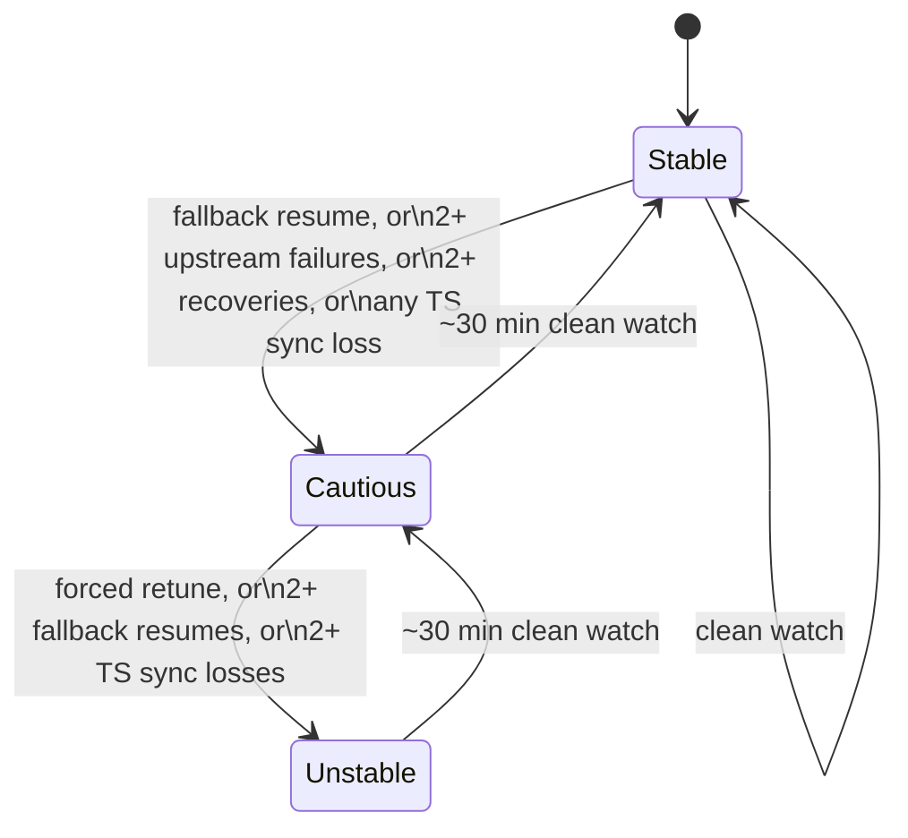

# Failure and Cooldown Model

[Retry, Failover, and Cooldowns](../concepts/retry-failover-cooldowns.md) is the operator-facing explanation — what you see on the Streams page and what you can tune. This page documents the actual mechanics behind it: the exact thresholds that move a channel between health grades, how long a cooldown really lasts for each kind of failure, and what "last-known-good" means at the snapshot level.

## Stream health: the exact thresholds

Every channel's health grade is recomputed from a rolling 24-hour window of recorded events for that specific provider channel — upstream failures, recovery resumes (and whether they used the precise or the fallback resume method), forced retunes, and TS sync-loss events. The classification is a fixed rule, not a score you can tune:

- **Unstable** — a forced retune happened, *or* two or more recoveries had to use the imprecise fallback resume, *or* two or more TS sync-loss events occurred in the window.
- **Cautious** — none of the above, but at least one fallback resume, or two or more plain upstream failures, or two or more recoveries of any kind, or any TS sync loss at all.
- **Stable** — none of the above.

Healing only ever moves one grade at a time, never straight from Unstable to Stable in one step: once continuous clean-watch time since the last adverse event reaches roughly 30 minutes, the grade steps down exactly one level (Unstable → Cautious, or Cautious → Stable) on the next evaluation. A channel that was Unstable needs a second clean 30-minute window after reaching Cautious before it's graded Stable again.

## What changes for an Unstable channel

Health grade isn't just a label — it changes two concrete recovery parameters for that channel's session:

- **Longer output hold, wider search.** A Stable or Cautious channel uses your configured recovery hold limit and safe-start search budget. An Unstable channel gets both raised to a fixed floor (a longer hold, and a search budget of at least 2 MB) regardless of your configured defaults — it's given more room to find a genuinely clean resume point before giving up.
- **No imprecise fallback allowed.** Normally, if the session can't find a clean keyframe boundary within its search budget, it falls back to a less precise packet-boundary resume rather than stall indefinitely. For an Unstable channel, that fallback is disabled entirely — it either finds a clean boundary or it doesn't resume, because a channel that's already shown corruption gets no shortcuts that could make it worse.

Health grade also feeds the relay-mode decision (direct vs. clean FFmpeg remux) described in [Stream Pipeline](stream-pipeline.md#relay-mode-direct-or-clean-remux) — an Unstable channel on a provider whose relay policy is **Auto** gets clean remux automatically.

## Cooldown durations by failure kind

When a channel's reconnect attempts run out, it's put on a cooldown before new tune requests are allowed to try again. The fallback duration depends on what kind of failure ended the session — providers that return an explicit `Retry-After` value always override these:

| Failure kind | Fallback cooldown |
|---|---|
| Rate limited by the provider | 60 seconds |
| Proxy authentication required | 30 seconds |
| Upstream server error | 30 seconds |
| Transport error, timeout/stall, or unexpected end of stream | 15 seconds |

Every fallback value is capped at a global ceiling (5 minutes by default) regardless of kind — even a provider-supplied `Retry-After` that's absurdly long is not honored past what the fallback logic would otherwise allow to reach; a `Retry-After` of zero or negative is treated as "retry almost immediately" (1 second) rather than skipped. This is what keeps a single badly-behaved channel from either hammering your provider connection limit or locking a channel out indefinitely.

## Reconnect timing: three different stall clocks

Not every kind of session notices a stall at the same speed, and that's deliberate:

- **Direct MPEG-TS relay** uses the shortest stall clock (a few seconds of no real content) — a direct relay stall means M3Undle itself has to reconnect, so detecting it fast keeps the on-screen freeze short.
- **FFmpeg relay sessions** (clean remux or generated HLS) use a longer stall clock than direct relay, deliberately — FFmpeg already reconnects to the provider on its own, and tearing the whole session down too eagerly would fight FFmpeg's own recovery instead of letting it work.
- **Byte-arrival timeout** is the outermost safety net — if literally no bytes arrive at all (not even keepalive filler) for the longest of the three windows, the connection is abandoned regardless of relay mode.

## Recovery overlap trim, and when it gives up

[Stream Pipeline](stream-pipeline.md#reconnects-clean-resume-not-a-raw-splice) describes overlap trim from the outside: on reconnect, hold output and resume at the first keyframe at or after the last timestamp relayed before the failure, so a provider's replay buffer doesn't flood the client with content it already saw. The trim has real limits so it can't itself become the problem:

- It runs against a **wall-clock hold budget** (a few seconds by default) — replayed content arrives far faster than real time, so if a match hasn't been found by the time the budget expires, the trim is abandoned and the session falls back to a plain first-keyframe resume instead of holding output indefinitely.
- A rewind larger than a configured ceiling (180 seconds by default) is treated as **not a replay at all** — more likely the provider's encoder restarted and reset its own timeline — so trim doesn't even attempt to match it.
- After a trim is abandoned, trimming is **suppressed for a cooldown period** before it can arm again on that session. Without this, a source whose every reconnect looks rewound (some FFmpeg-relay restarts do) would re-enter a fresh trim attempt on every single failure, each with its own hold budget — degrading to the plain resume path is the better outcome for a source shaped like that.

## Last-known-good snapshots

None of the above is about *whether a channel plays* — it's about *how quickly and cleanly* a session recovers once something goes wrong. The lineup-level equivalent is what happens when a provider's playlist fetch itself fails during a scheduled refresh, described in [System Overview](system-overview.md#the-refresh-and-snapshot-lifecycle): that provider's refresh stops at the fetch step, nothing about the published channel index or guide changes, and the previously active snapshot keeps serving every client exactly as before. A bad refresh degrades to "no update this cycle," never to "no lineup."
