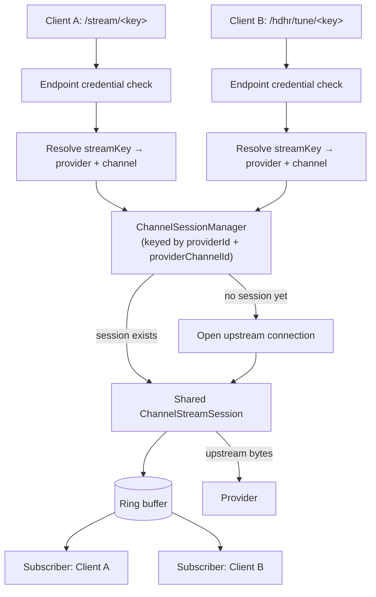

# Stream Pipeline

[Stream Proxying](../concepts/stream-proxying.md) and [Retry, Failover, and Cooldowns](../concepts/retry-failover-cooldowns.md) explain *what* the stream proxy does for you. This page explains *how* — the actual request path from a client's `/stream/<streamKey>` request down to the provider and back, and why it's built as a shared session rather than one connection per viewer.

## One upstream connection, fanned out to every subscriber

The unit of work inside the stream pipeline isn't "a request" — it's a **channel session**, keyed by `(providerId, providerChannelId)`. The first client to request a given channel causes a session to be created and an upstream connection to be opened; every subsequent client requesting that *same* channel — regardless of whether they came in through `/stream/<streamKey>`, `/hdhr/tune/<streamKey>`, or the Xtream path-credential route — attaches to the **same** session as a subscriber. Nobody opens a second upstream connection for a channel that's already playing.

A small in-memory ring buffer sits behind the session — new subscribers attach to it rather than to the raw upstream feed, which is what lets a late joiner start mid-stream without a second provider connection and lets the session absorb brief upstream hiccups without every subscriber feeling them individually.

## Joining cleanly: safe-start boundaries

A new subscriber (or one resuming after a resync — see below) doesn't start receiving bytes the instant it attaches. For MPEG-TS relay, the session waits for the next clean boundary — a fresh PAT/PMT pair plus an H.264 IDR (keyframe) — before handing that subscriber its first bytes. Starting mid-GOP would hand a decoder a picture it can't reconstruct; starting at a clean boundary costs a couple of seconds of latency but guarantees a decodable stream from the first byte.

## Slow subscribers don't stall the session

Each subscriber has its own outbound queue. If a subscriber can't keep up (a slow network, a stalled player), its queue fills — but that doesn't block the shared session or any other subscriber. Instead:

1. The slow subscriber enters a **resync-pending** state: no new data is enqueued for it while its queue drains.
2. If the queue drains and a clean TS boundary (PAT/PMT + IDR) arrives before a grace period expires, the subscriber resumes cleanly at that boundary — it skips the backlog rather than trying to catch up byte-for-byte.
3. If the queue is still stuck when the grace period expires, that subscriber is evicted as a slow client. Everyone else on the session is unaffected.

This is the mechanism that keeps one weak connection from degrading playback for every other viewer of the same channel.

## Reconnects: clean resume, not a raw splice

When the upstream connection drops, the session doesn't just reconnect and start forwarding whatever comes back immediately — some providers replay 60–90 seconds of their own ring buffer on a fresh connection, and splicing that in verbatim would hand every subscriber a chunk of content they already watched. The session tracks the timestamp of the last video frame it relayed before the failure and, on reconnect, holds output while it looks for either:

- an **overlap trim** point — the first keyframe at or after that pre-failure timestamp, so replayed content is discarded and playback resumes exactly where it left off, or
- if no timestamp-based match is found within its search budget, a **plain first-keyframe resume** — less precise, but still a clean, decodable starting point rather than a garbled splice.

How long the session is willing to search, and whether the less-precise fallback is allowed at all, depends on the channel's recent health — see [Failure and Cooldown Model](failure-and-cooldown-model.md#what-changes-for-an-unstable-channel).

The same guard also covers a reconnect performed internally by FFmpeg. In that case the FFmpeg process and its output pipe remain open, so there is no outer connection event for M3Undle to observe. A backward video-DTS jump within that continuous pipe activates the same bounded overlap hold before replayed packets enter the downstream buffer.

## Relay mode: direct or clean remux

Every session relays either **direct** (upstream bytes forwarded untouched) or through an FFmpeg **clean remux** step (repackaged into well-formed MPEG-TS, same picture, no re-encode). The decision is evaluated per session at connect time from two inputs: the provider's configured relay policy (Auto / On / Off) and, when Auto, the channel's current health grade. See [Retry, Failover, and Cooldowns](../concepts/retry-failover-cooldowns.md#overriding-the-automatic-behavior) for the operator-facing controls.

## Downstream compatibility: keepalives and generated HLS

The same shared session serves genuinely different downstream consumers without opening extra upstream connections for any of them:

- **Stall-sensitive external players** (typically browsers) can receive null-PID MPEG-TS keepalive packets during brief upstream gaps, so the player's own stall detection doesn't give up mid-reconnect.
- **HDHomeRun-only sessions never get keepalives injected** — DVR transcode pipelines expect unmodified upstream bytes, and a keepalive packet would look like real (if empty) content to them.
- **Browser HLS requests** don't get a second upstream connection either. When a browser asks for `?format=hls` (or is detected by user agent) and the channel isn't already native HLS upstream, M3Undle resolves or creates the same shared relay session described above and feeds FFmpeg from *that* internal feed to generate HLS segments on demand. The first HLS viewer never touches the raw provider URL directly.

## Where this fits in the request path

Every route above — `/stream/<streamKey>`, `/hdhr/tune/<streamKey>`, and the Xtream path-credential form — passes through the same endpoint-credential filter before it ever reaches session resolution. See [Profile and Security Model](profile-and-security-model.md#the-client-endpoint-filter) for how that filter is wired across every client-facing route, and [System Overview](system-overview.md#where-clients-actually-connect) for the full list of surfaces that ultimately terminate here.
