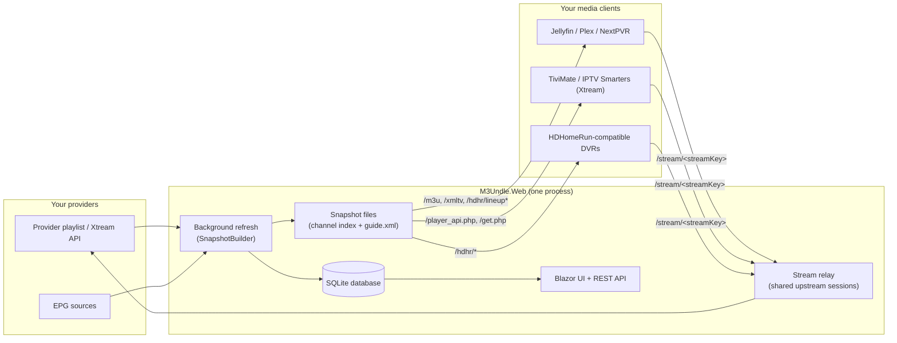

# System Overview

M3Undle runs as a single process (`M3Undle.Web`) that does four jobs at once: a Blazor Server admin UI, a REST management API, a background refresh pipeline, and a set of HTTP endpoints that look like a real IPTV/HDHomeRun/Xtream provider to your media clients. This page is the map — how those pieces fit together, and where to read more about each one.

## The moving parts

A few things fall out of that picture immediately:

- **Clients never see your provider.** Every playlist, guide, and stream URL M3Undle hands out points back at itself. Provider credentials and raw stream URLs never leave the process — see [Profile and Security Model](profile-and-security-model.md) and [Stream Proxying](../concepts/stream-proxying.md).
- **The background refresh cycle is the only thing that writes the lineup.** The UI lets you shape *what* the next refresh will publish (which groups, which channels, which numbers); it doesn't publish anything itself.
- **The database and the published snapshot are different things.** The database holds your configuration and the provider's current channel/group catalog. The snapshot is a set of files (a channel index and a compiled XMLTV guide) that a refresh produces and that the HTTP layer actually serves. This split is what makes [last-known-good](failure-and-cooldown-model.md#last-known-good-snapshots) possible.

## Core concepts

| Concept | What it is |
|---|---|
| **Provider** | An upstream source of channels — a playlist URL, an uploaded file, or a native Xtream Codes account. See [Providers](../concepts/providers.md). |
| **Profile** | Scopes a set of linked providers, group/channel decisions, and EPG mappings into one published output. Exactly one profile is active at a time; the active profile is what clients actually receive. See [Profiles and Users](../concepts/profiles-and-users.md). |
| **Snapshot** | The atomic, published result of a refresh for one profile: a channel index plus a compiled XMLTV guide. Built to a staged location, then promoted to active only if it actually differs from what's live. See [Snapshot lifecycle](#the-refresh-and-snapshot-lifecycle) below. |
| **Stream key** | The stable, opaque token in every `/stream/<streamKey>` URL. Derived from the channel's `tvg-id` (or its display name and stream URL, if no `tvg-id` exists) hashed together with the profile ID — so it stays the same across refreshes as long as the channel's identity doesn't change, but a client can never reverse it back into a real provider URL. |
| **Canonical channel** | A stable, provider-independent channel identity — the schema exists (`canonical_channels`, `channel_sources` in the database) but it's **not populated or used by the current publish pipeline**. Today's stream keys and numbering are derived directly from provider-channel data, not from canonical channels. This is forward-compatibility scaffolding for a future release, not current behavior — worth knowing so you don't go looking for functionality that isn't there yet. |

## The refresh and snapshot lifecycle

Everything published to clients traces back to one background cycle, run on your configured schedule (or on demand from **Refresh Lineup** on the dashboard):

1. **Fetch.** Each enabled provider's playlist (or Xtream API listing) is fetched. If this fails, that provider's refresh stops here — **the currently active snapshot keeps serving**, nothing about the published lineup changes.
2. **Sync to the database.** Parsed channels and groups are written to `provider_channels` / `provider_groups` — this is the volatile, provider-reported world, refreshed every cycle. New groups land as pending for review (or auto-included, depending on your group mode); new channels within event-tracking groups follow the tracking policy you've set. See [Channels and Groups](../concepts/channels-and-groups.md).
3. **Fetch and compile EPG.** Guide data from every enabled EPG source is fetched (subject to each source's own cache cadence), auto-mapped to channels, and compiled into one merged `guide.xml`. Full detail in [EPG Pipeline](epg-pipeline.md).
4. **Build the channel index.** For every profile linked to this provider, M3Undle walks your group/channel decisions (included/excluded/pending, manual overrides, custom groups, auto-numbering ranges) and produces an ordered list of published channels with their final numbers, names, and stream keys.
5. **Classify the change.** The new channel index and guide are compared against the currently active snapshot and classified — no real change, guide-only, lineup change, or a breaking change (identity churn that could confuse a DVR). If nothing actually changed, the newly built snapshot is discarded and the active one keeps its timestamp; there's no needless client-visible "update" for a no-op refresh.
6. **Promote.** A real change is written to a new snapshot directory, marked `staged`, then atomically flipped to `active`. Older snapshots are pruned after promotion.

This is why a broken provider or a bad EPG fetch never blanks out your lineup: steps 1–5 can fail independently per provider, and the active snapshot from the last successful run is what clients keep seeing throughout. See [Failure and Cooldown Model](failure-and-cooldown-model.md#last-known-good-snapshots) for exactly what "fails" means at each stage.

## Where clients actually connect

The published snapshot is served through a small, fixed set of HTTP surfaces — all backed by the same active snapshot, so a Jellyfin instance and a TiviMate install pointed at the same M3Undle profile always see the same lineup:

- **M3U + XMLTV** — `/m3u/m3undle.m3u`, `/xmltv/m3undle.xml` — for players that consume a playlist directly.
- **HDHomeRun HTTP API** — `/hdhr/discover.json`, `/hdhr/lineup.json`, `/hdhr/tune/<streamKey>`, and related endpoints — for DVR software that expects a real HDHomeRun tuner. See [HDHomeRun-Compatible Clients](../clients/hdhomerun-compatible-clients.md).
- **Xtream Codes API** — `player_api.php`, `get.php`, and path-credential stream routes — for apps like TiviMate and IPTV Smarters that speak Xtream natively.
- **Stream relay** — `/stream/<streamKey>` (and route-specific equivalents like `/hdhr/tune/<streamKey>` and the Xtream path form) — every playable URL in every format above ultimately resolves here. See [Stream Pipeline](stream-pipeline.md).

All of them are gated by the same endpoint-credential check when you turn it on — see [Profile and Security Model](profile-and-security-model.md#two-independent-locks).

## Observability

M3Undle exposes its own health as a first-class surface, not an afterthought: a Prometheus-compatible `/metrics` endpoint, liveness/readiness probes (`/livez`, `/readyz`, `/healthz`), and admin-only JSON diagnostics under `/api/admin/diagnostics/*`. None of these are part of the client-facing contract above — they're for you (and your monitoring stack), not for a media player. See [Observability](../concepts/observability.md) and [Monitor with Prometheus / Grafana](../guides/monitor-with-prometheus-grafana.md).
